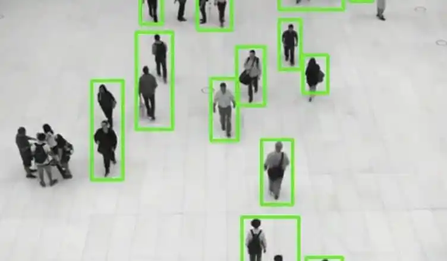
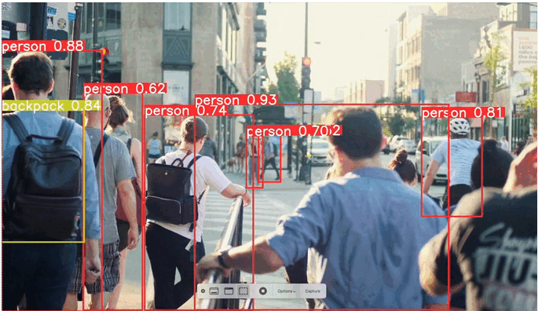

# person_detection

Sistema de detección y seguimiento de personas en tiempo real, desarrollado en Python con OpenCV y MobileNet‑SSD.
 Instalación

Clona este repositorio:

git clone https://github.com/juancjaramillo/person_detection.git
cd person_detection

Crea y activa un entorno virtual:

# Windows (PowerShell)
py -3 -m venv venv
Set-ExecutionPolicy -ExecutionPolicy RemoteSigned -Scope CurrentUser
.\venv\Scripts\Activate.ps1

:: Windows (CMD)
py -3 -m venv venv
venv\Scripts\activate.bat

# Unix / MacOS
python3 -m venv venv
source venv/bin/activate

Instala las dependencias:

pip install --upgrade pip
pip install -r requirements.txt

Descarga y coloca los modelos en models/:

MobileNetSSD_deploy.prototxt

MobileNetSSD_deploy.caffemodel

▶️ Uso

Con el entorno activo:

python main.py

Se abrirá la ventana de la cámara.

Verás rectángulos verdes alrededor de las personas y sus centroides con IDs.

En consola se imprimirán las coordenadas normalizadas (función send_control_command).

Presiona q para salir.

📋 Detalles del proyecto

Lenguaje: Python 3.x

Framework: OpenCV DNN + MobileNet‑SSD

Módulos clave:

centroid_tracker.py: lógica de tracking basada en centroides.

main.py: carga del modelo, detección y control.

Dependencias:

opencv-python

imutils

numpy

scipy

🤝 Contribuciones

¡Las contribuciones son bienvenidas! Abre un issue o un pull request con tus mejoras.

📝 Licencia

Este proyecto utiliza la licencia MIT. Consulta el archivo LICENSE para más detalles.

